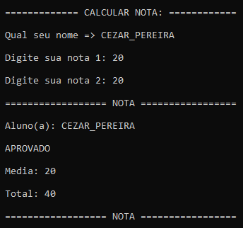
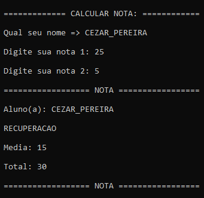
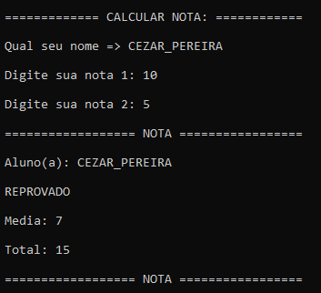
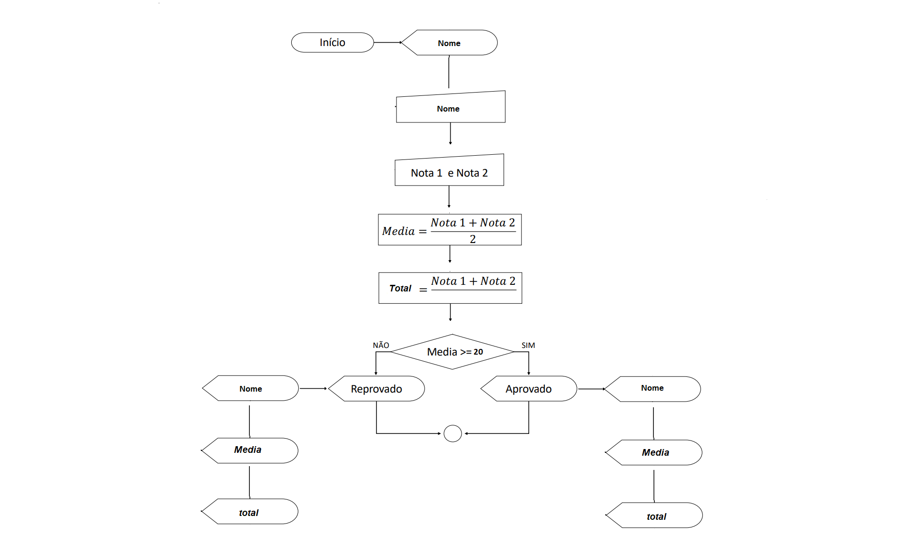

🟢🟡🔴

<h1 style="text-align: center;">Calculador de NOTA </h1>
<h2 style="text-align: center;">Exemplos de como funciona o projeto em C / C++</h3>
 

 

    

        <h2  style="display:flex; justify-content:center; aling-items:center;">🟢 EXEMPLO: APROVADO 🟢</h2>
         
        
    

 

    

        <h2  style="display:flex; justify-content:center; aling-items:center;">🟡 EXEMPLO: RECUPERAÇÃO 🟡 </h2>
         
        
    

 

    

        <h2  style="display:flex; justify-content:center; aling-items:center;">🔴 EXEMPLO: REPROVADO 🔴 </h2>
         
        
    

    

        <h2  style="display:flex; justify-content:center; aling-items:center;">📌 FLUXOGRAMA DO PROJETO 📌</h2>
         
        
    

